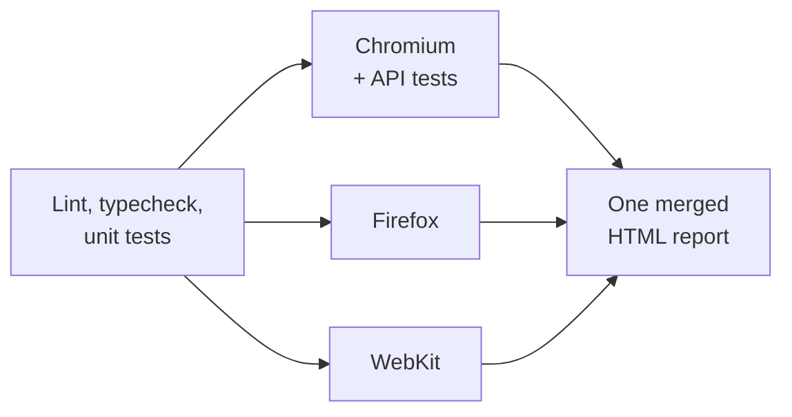

# Playwright tests for Firefly III

[](https://github.com/HenriqueRicieri/playwright-firefly-iii/actions/workflows/tests.yml)

End-to-end, API and accessibility tests for [Firefly III](https://github.com/firefly-iii/firefly-iii), an open
source personal finance manager, written with Playwright and TypeScript and run against a pinned instance in
Docker.

In finance software a bug moves money. So most tests follow one pattern:

1. **Arrange through the API:** create the accounts and transactions the test needs.
2. **Act through the UI:** do what a user would do.
3. **Assert through the API:** check the stored result, to the cent, below the screen.

## At a glance

|           |                                                                                             |
| --------- | ------------------------------------------------------------------------------------------- |
| Tests     | 48: 33 UI, 6 API contract, 9 unit tests of the suite's own money helpers                    |
| Browsers  | Chromium, Firefox and WebKit, each in its own CI job                                        |
| Domain    | balances, transfers, rounding, reconciliation, rules, budgets, splits, multiple currencies  |
| Contract  | every API response validated against a schema, error bodies included                        |
| Isolation | a new Firefly user per Playwright worker: no shared data, no shared session                 |
| Stability | no fixed waits, uncaught page errors fail the test, CI can repeat the whole suite on demand |
| Findings  | a Firefly bug kept as an expected failure, plus an accessibility baseline (see below)       |

## Run it

Requirements: Docker and Node 24.

```bash
npm ci
npx playwright install chromium firefox webkit
npm run env:up      # Firefly III 6.7.4 + MariaDB on http://localhost:8080
npm test            # everything; or test:unit, test:api, test:e2e
npm run report      # HTML report with a trace for each failure
npm run env:down    # removes the containers and the database
```

The suite prepares an empty instance by itself. A setup step registers the administrator and opens
registration. Then every Playwright worker registers its own user, completes the first-run wizard and creates a
Personal Access Token through the UI. Nothing needs to be clicked by hand.

## Why these scenarios

**Accounts.** Every balance starts from the opening balance. If that is stored wrong, every number after it is
wrong too.

**Transactions and balances.** The core of a ledger. A withdrawal lowers the balance by exactly its amount, a
deposit raises it, and a transfer moves money between two accounts while their sum stays the same. Editing an
amount recalculates the balance and deleting a transaction puts it back.

**Amounts.** Where classic finance bugs live: one cent, very large numbers, zero and negative values, and
rounding. One test uses three withdrawals of 0.004 because the result tells the rounding strategies apart:
rounding each transaction gives 100.00, truncating the total gives 99.98, rounding the total gives 99.99.
Firefly rounds the total.

**Reconciliation.** Checking the ledger against a bank statement, line by line. When both agree, the ticked
transactions are cleared and nothing is added. When the bank shows less money, the stored correction brings the
ledger exactly to the statement. A transaction that is not on the statement yet stays open.

**Automatic rules.** Rules change data without anyone looking. A rule that sets a category must fire on a
matching transaction created in the UI, ignore one that does not match, and stay quiet when "Apply rules" is
unticked.

**Budgets.** An expense linked to a budget moves what was spent against the limit by exactly its amount. An
expense without a budget does not touch it.

**Splits and currencies.** The parts of a split transaction add up to exactly what left the account. A transfer
from EUR to USD moves each side by its own amount, and Firefly refuses to store one without the destination
amount instead of guessing an exchange rate.

**API contract.** Authentication, validation messages per field, and a round trip where what is stored is what
comes back. The API is a product surface, not only a shortcut for test setup.

**Accessibility.** axe checks five screens against WCAG 2 A/AA.

## What the suite found in Firefly III 6.7.4

- **Bug:** the API creates an asset account in a currency that is disabled for the user. The transfer form then
  throws a JavaScript error and Submit stays on "storing your transaction" forever, with no message. The test is
  kept as an expected failure (`test.fail()`), so the day it is fixed upstream the suite reports it.
- **Accessibility:** the suite had to work around inputs with no accessible name (the balance on the
  first-run wizard, the budget select, the reconciliation balances). axe also reports buttons and links without
  names, list markup that is not a list, and low contrast. Its findings are recorded per screen in
  [`a11y-baseline.json`](tests/e2e/a11y-baseline.json): a new kind of violation fails the build, and so does a
  fixed one, to keep the baseline honest.
- **Markup:** the group title field of a split transaction is rendered once per split with the same id.
- **Odd message:** a transfer between currencies without the destination amount is rejected with "This field
  requires a number" for a field that was not sent at all.
- **Design choices, documented rather than reported:** amounts with more decimals than the currency allows
  (`10.999` EUR) are accepted and stored in full; only the displayed balance is rounded.

## How the suite is built

```
docker/        pinned Firefly III + MariaDB for a disposable test instance
src/api/       typed API client and the zod schemas every response is checked against
src/pages/     page objects, one per screen, with named steps for readable reports
src/fixtures/  Playwright fixtures: one user per worker, API client, page objects, page error guard
src/data/      unique test data and exact decimal math for money
tests/setup/   once per run: instance health, administrator, open registration
tests/unit/    tests of the suite's own helpers (no browser, no Firefly)
tests/api/     API contract tests
tests/e2e/     UI flows checked through the API, plus accessibility
```

Rules the suite follows:

- **Independent tests.** Each test creates its own data with unique names, so tests run in parallel and in any
  order.
- **No fixed waits.** Tests wait for state: a locator, a URL, a network response. Lint rejects
  `waitForTimeout`, `networkidle`, `force` and any promise that is not awaited.
- **User-facing locators first** (`getByRole`, `getByPlaceholder`). Where Firefly's markup has no accessible
  name, the page object says why it falls back to an id.
- **Money is never a float.** Amounts stay decimal strings and are compared exactly, to the cent.
- **Readable failures.** Page object and API methods appear as named steps in the report and the trace, and a
  failed registration says what the page showed.
- **Pinned versions.** The Firefly III image tag is fixed. Dependabot proposes upgrades as pull requests, and an
  upgrade is merged only if the suite passes.

## Problems solved along the way

- **Guided tours.** Firefly shows a tour on the first visit to each screen. Closing it returns focus to the
  previously focused field, which sent typed text into the wrong input. Every user marks all tours as seen
  through the endpoint the tour itself calls.
- **Shared session.** Firefly keeps flash messages and validation errors in the session. With one session for
  all workers, one test consumed the error message another was waiting for. It passed locally and failed only
  when CI repeated the suite.
- **Login limit.** Firefly allows 5 login attempts per minute per IP address, not per user, and the whole suite
  runs from one IP. Workers register new users instead of logging in, which never touches the limit.
- **Controls that are not ready.** The transaction form renders its inputs before the autocomplete is attached,
  and the token page's buttons ignore clicks until their Vue component mounts. The page objects wait for the
  signal that each one is live: the input becoming a combobox, the request the component makes when it mounts.
- **WebKit under load.** WebKit sometimes dropped the click on Register: valid form, no request sent. The click
  is repeated only while no request has left the browser, so it can never register a user twice.
- **Time zones.** The CI runner is UTC and the app runs in America/Sao_Paulo. The browser uses the app's time
  zone, and data created through the API is dated in the past, so "today" never means "tomorrow" for the
  server.

## CI



Each browser job starts its own Firefly III with an empty database. Traces of failed tests are uploaded as
artifacts, and the blob reports of all jobs are merged into a single HTML report. The workflow can also be
started by hand with `repeat_each` to run every test several times and catch flaky ones.
